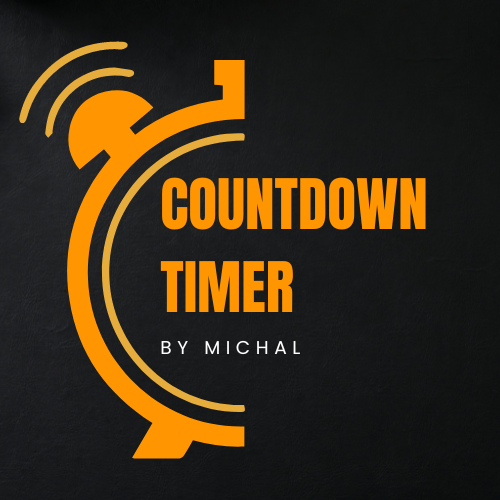
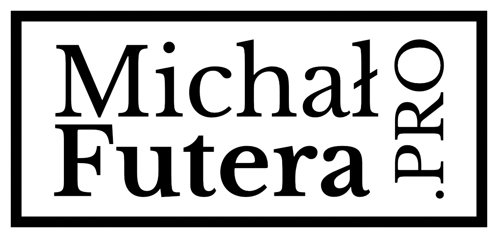
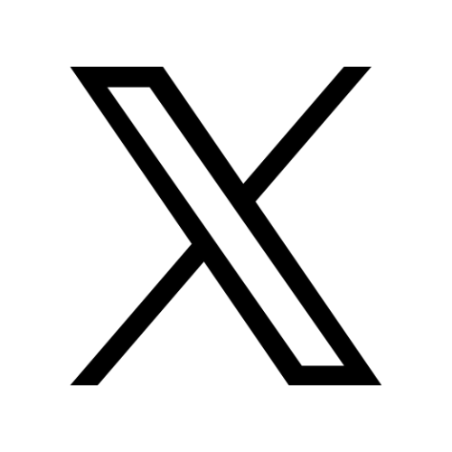
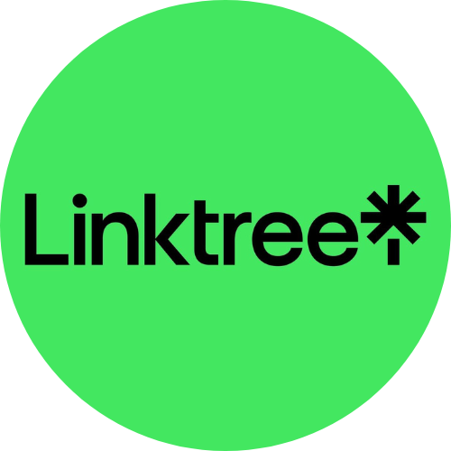

# Countdowns - Chrome Extension

	

Countdowns is a Chrome extension for tracking important events with clean, visual countdown timers right on your New Tab page.

## Links

- Public repository: https://github.com/mjfutera/CountdownTimer-Browser-extension
- Project page: https://michalfutera.pro/my-projects/countdown-timer-chrome-extension/
- Author website: https://michalfutera.pro
- Telegram: https://t.me/MichalFuteraPro

## Socials

	
	&nbsp;
	
	&nbsp;
	
	&nbsp;
	
	&nbsp;
	
	&nbsp;
	
	&nbsp;
	

## Key Features

- Multiple countdown timers in one place
- New Tab integration for quick access
- Progress indicators and clean timer cards
- Browser notifications for timer milestones
- Persistent storage and schema migration support

## Stack and Structure

- Manifest V3 Chrome extension
- Vanilla JavaScript, HTML, CSS
- `core.js` for date/time logic
- `storage.js` for persistence and migrations
- `ui.js` for rendering helpers
- `notifications.js` for sound/notifications
- `background.js` for alarms lifecycle

## Quality

- ESLint + Prettier
- Unit tests in `tests/core.test.js`
- CI workflow in `.github/workflows/ci.yml`
- Packaging script in `tools/package-extension.ps1`